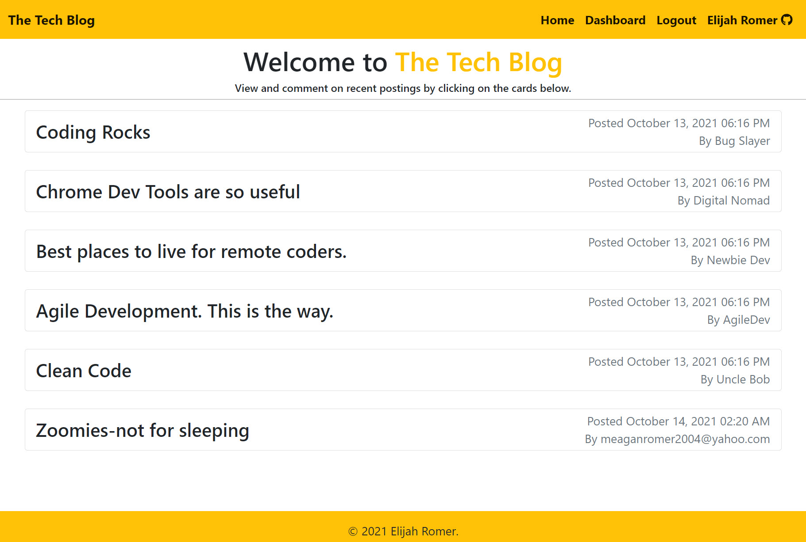
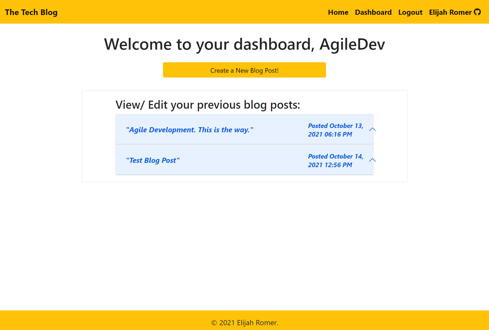

# The Tech Blog [")](https://opensource.org/licenses/MIT)
  
  ## Description
  This application was created with the intention of being a platform for tech-savvy and interested individuals to collaborate and write about relevant topics that they are studying or involved in. Users can create accounts, make blog posts, leave comments on others and their own blog posts, as well as edit posts and comments. 

  _**Click [HERE](https://the-tech-blog-website.herokuapp.com/) to visit the deployed application, or paste the following URL into your browser:**_

  ```bash
  https://the-tech-blog-website.herokuapp.com/
  ```

### Technologies Used:
* bcrypt - for hashing passwords for DB storage
* MySQL - for creating relational database and schema
* Sequelize - Object Relational Mapper (ORM)
* Express - for building server and routing
* Express-Session - for managing session cookies for login validation and user data
* Connect-Session-Sequelize - for saving session info to database

  
  

  ---
## Table of Contents
1. [Usage](#usage)
1. [Contribution](#contribution)
1. [License](#license)
1. [Questions](#questions)

  ---
  
## Usage
    
This website functions similar to many other websites, in that it has a homepage that can be viewed but not interacted with unless the user has an account and is logged in. Upon visiting the website, you are presented with a feed of posts. The posts can be viewed by clicking on the cards that displays the title and the user the posted it. This will expand the card to show the full blog post and recent comments. 

When a user is logged in, they may leave comments on a blog post. This will update the database with their comment and will be shown to all subsequent users that view the post. The comment can later be edited or deleted as long as you are logged into the account that left the comment. 

On the user Dashboard, users can create and manage their previous blog posts. This is achieved via the "create new blog post" button that is conspicuously displayed at the tope of the dashboard, or by clicking and expanding their previous blog posts from the list on their dashboard, in a somewhat similar fashion to viewing posts on the homepage. When the blog post is expanded on the dashboard, they are presented with buttons for editing or deleting their posts. 



In the unfortunate event that an error occurs, the user will be notified either by a message rendering on screen, or by being redirected to an error page informing them of the error. This presents them with the option of returning to the homepage and requests that they contact support if the problem persists.

Finally, users are able to log out by clicking the logout button at any time during their session. This will take them to a logout page that will confirm that they have been logged out, then redirect them to the homepage after 3 seconds. Additionally, a users logged in session will be automatically terminated after 15 minutes of inactivity. 

---

## Contribution
    
Thank you for considering contributing to this project. If you would like to contribute, feel free to fork the repository, add your functionality or bugfix, and submit a pull request. I will review the changes and contact you with any questions or concerns.

---

## License
  
  This application is licensed under **The Massachusets Institute of Technology License (MIT)**.
  
  Click the license badge below for more information and usage guidelines:
  
  [")](https://opensource.org/licenses/MIT)
  
  Click [here](https://www.mit.edu/~amini/LICENSE.md
  "MIT Full Terms and Conditions") to view the full terms and conditions text of MIT.
  
  ---
  
  ## Questions
  
Please do not hesitate to reach out with any questions you may have. I can be reached in the following ways:

* Email: [ElijahARomer@gmail.com](mailto:ElijahARomer@gmail.com)
* GitHub: [ElijahRomer](http://www.github.com/ElijahRomer)


Thank you for reaching out and I look forward to getting in touch with you soon!


